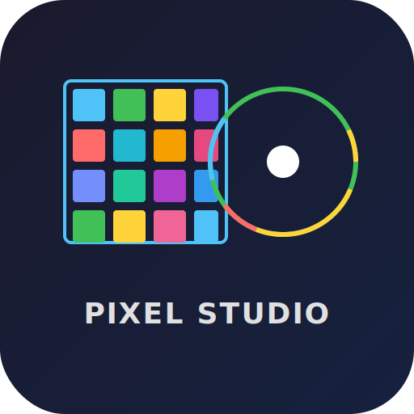

<p align="center">
  
</p>

<h1 align="center">Pixel Studio</h1>

<p align="center">
  <strong>A modern pixel art editor</strong>
  <br>
  Layers &middot; Animation &middot; Palette Generator &middot; PWA &middot; Desktop (Tauri)
</p>

<p align="center">
  
  
  
  
  
  
  
</p>

---

## Features

### Pixel Editor
- **10 Drawing Tools** &mdash; Pencil, Eraser, Eyedropper, Flood Fill, Line, Rectangle, Circle, Select, Spray, Replace Color
- **Brush Size** &mdash; 1x1, 2x2, 3x3 pixel support
- **Selection** &mdash; Select, move, cut, copy, paste, delete, fill regions
- **Symmetry** &mdash; Vertical, Horizontal, Both, Radial (4-way) mirror drawing
- **Canvas Controls** &mdash; Mouse wheel zoom, Space+drag pan, grid toggle
- **Resize Canvas** &mdash; Stretch, crop, or pad modes
- **Undo/Redo** &mdash; 50-step history

### Layer System
- **Multi-layer** &mdash; Add, delete, duplicate, merge, reorder layers
- **7 Blend Modes** &mdash; Normal, Multiply, Screen, Overlay, Darken, Lighten, Difference
- **Per-layer controls** &mdash; Visibility toggle, lock, opacity slider (0-100%)
- **Drag reorder** &mdash; Rearrange layers via drag-and-drop

### Animation Engine
- **Frame Timeline** &mdash; Add, delete, duplicate, reorder frames with thumbnails
- **Onion Skinning** &mdash; Previous/next frame ghost overlays (red/green tint, adjustable)
- **Playback** &mdash; Play/Pause, Stop, Forward and Ping-pong loop modes
- **Export GIF** &mdash; Encode animation as GIF via gif.js (CDN loaded)
- **Sprite Sheet** &mdash; Export all frames as PNG + JSON metadata

### Palette Generator
- **6 Harmony Modes** &mdash; Complementary, Split Complementary, Analogous, Triadic, Tetradic, Monochromatic
- **Save Palettes** &mdash; Persist palettes via IndexedDB
- **Load from Image** &mdash; Upload an image to extract 8 dominant colors
- **UI Preview** &mdash; See your palette on UI elements (Dark/Light/High Contrast)
- **CSS Export** &mdash; One-click copy as CSS variables

### Project Management
- **.pxs Project Files** &mdash; Save and load complete projects (frames, layers, canvas)
- **Auto-Recovery** &mdash; 30-second auto-save to localStorage, restore prompt on launch
- **Keyboard Shortcuts** &mdash; Ctrl+N (New), Ctrl+O (Open), Ctrl+S (Save), Ctrl+E (Export)

### Plugin System
- **Plugin API** &mdash; Register custom tools, filters, and export formats
- **Built-in Plugins** &mdash; Floyd-Steinberg dither, GIMP palette interchange
- **Compatible** &mdash; Load plugins via script tag or dynamic import

### PWA &amp; Desktop
- **Progressive Web App** &mdash; Installable, works offline, service worker caching
- **Tauri v2** &mdash; Desktop app (~5MB) with native file dialogs, system menus, auto-update (scaffold ready)
- **GitHub Pages** &mdash; Deployed at `https://redrighthand05.github.io/pixel-studio/`

---

## Quick Start

Open `index.html` in any modern browser, or visit the [GitHub Pages deployment](https://redrighthand05.github.io/pixel-studio/).

```bash
git clone https://github.com/REDrighthand05/pixel-studio.git
cd pixel-studio
# No build step needed for the web version
# Open index.html in your browser
```

### Desktop Build (Tauri)

```bash
# Prerequisites: Rust + VS Build Tools
rustup install stable
cargo install tauri-cli --version "^2"
cd src-tauri
cargo tauri build  # Produces .msi / .dmg / .AppImage
```

---

## Keyboard Shortcuts

| Key | Action | Key | Action |
|-----|--------|-----|--------|
| P | Pencil | E | Eraser |
| I | Eyedropper | F | Fill |
| L | Line | R | Rectangle |
| C | Circle | M | Select |
| S | Spray | K | Replace Color |
| G | Toggle Grid | ? | Help overlay |
| Ctrl+Z | Undo | Ctrl+Shift+Z | Redo |
| Ctrl+N | New Project | Ctrl+O | Open Project |
| Ctrl+S | Save Project | Ctrl+E | Export |
| Ctrl+A | Select All | Delete | Clear selection |
| Esc | Deselect / Close | Space+Drag | Pan canvas |
| Scroll | Zoom in/out | Shift | Constrain (circle/line) |

---

## Tech Stack

| Layer | Technology |
|-------|-----------|
| Rendering | HTML5 Canvas (2D) |
| Styling | CSS Custom Properties (Dark theme) |
| Storage | IndexedDB + localStorage |
| Architecture | Single Page Application |
| Web Distribution | PWA (Service Worker + Manifest) |
| Desktop | Tauri v2 (Rust + WebView) |
| Color Engine | HSL-based palette generation |
| CI/CD | GitHub Actions |

---

## Plugin Development

```js
PixelStudioPlugin.register({
  name: "My Plugin",
  version: "1.0.0",
  description: "Adds custom functionality",
  tools: [{
    id: "my-tool",
    name: "My Tool",
    icon: "\u2728",
    onPointerDown(x, y) { /* handle click */ },
    onPointerMove(x, y) { /* handle drag */ },
    onPointerUp(x, y) { /* handle release */ }
  }],
  filters: [{
    id: "my-filter",
    name: "My Filter",
    apply(layerData, params) { /* return modified layerData */ }
  }]
});
```

See [plugin-loader.js](./plugin-loader.js) for the full API reference.

---

## Project Structure

```
pixel-studio/
├── .github/workflows/      # CI/CD (Pages, Lighthouse)
├── plugins/                # Plugin system + examples
├── src-tauri/              # Tauri v2 desktop app
├── app.js                  # Core editor (~65KB, 787 lines)
├── index.html              # UI + PWA manifest link
├── styles.css              # Extracted stylesheet
├── plugin-loader.js        # Plugin registration API
├── manifest.json           # PWA manifest
├── sw.js                   # Service Worker
├── TESTING.md              # Non-visual verification guide
└── ROADMAP.md              # Development roadmap
```

---

## Releases

| Version | What's New |
|---------|-----------|
| v0.3.0 | 10 drawing tools, palette generator |
| v0.5.0 | Layer system, 7 blend modes |
| v0.7.0 | Animation engine, GIF/sprite export |
| v1.0.0 | .pxs project files, auto-recovery |
| v1.1.0 | PWA hardening, service worker |
| v1.5.0 | Symmetry drawing, plugin system |
| [v2.0.0] | _(planned)_ Tauri desktop app, plugin marketplace |

## License

MIT License

---

<p align="center">
  <em>Built with Codex, one pixel at a time.</em>
  <br>
  <a href="https://github.com/REDrighthand05/pixel-studio/issues">Report Bug</a>
  &middot;
  <a href="https://github.com/REDrighthand05/pixel-studio/discussions">Discussion</a>
  &middot;
  <a href="https://redrighthand05.github.io/pixel-studio/">Live Demo</a>
</p>
